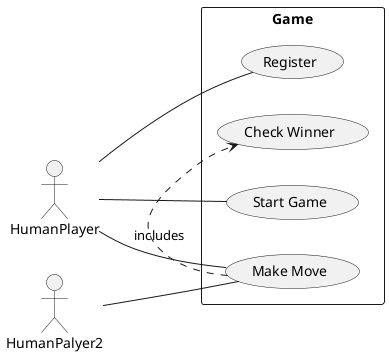

## 

### **User management**
    - Users can log in / register using basic info
    - Email id & username are unique per user
    - Once logged in, user stays logged in until cache is cleared from the browser
### **Starting an asynchronous game with anyone via their emai id**
    - I can only have one ongoing game with any other user
    - Until that game is finished, I can’t start another game with the same user
    - I can start a game with anyone using their email id
    - As soon as the game is created, the intiator gets the first move & other user’s home page reflects the game
    - Every player sees `X` as their piece & `O` as the other player’s piece in every game
### **Gameplay**
    - Should support standard 3x3 Tic Tac Toe game
    - First player to put their piece in 3 consecutive squares wins the game
    - Game can be drawn too
    - These are the possible game states at any point in the game
        - Won
        - Drawn
        - Waiting for other player to play
        - Waiting for you to play
### **Home page**
    - As soon as the games are started, a card is created for every game
    - These cards are sorted in descending order of their last updated time
        - Update only happens when the state of the game changes i.e.
            - When either players play or
            - Game finishes
### **Layout**
    - For the scope of this project, only mobile web layout shall be supported
### **Miscellaneous**
    - There’s a chance all edge cases are not supported in the design. Please make your assumptions & state the same in the comments / documentation
    
    
    
  ### What do you have to submit here?

---

- **Working public URL of deployed game**
    - You can deploy your frontend & backend on any of the free public services like netlify
- **Access/link to GitHub repositories which includes -**
    - All the code
    - Documentation on how to run the code
    - Logical explanation of all your architectural choices in the project
    - Assumptions that you have made
    - **Document of the problems you faced while building this app**

## What is Tic-Tac-Toe?

TicTacToe is a 2 player game played on a 3 x 3 board. Each player is allotted a symbol (one X and one O). Initially, the board is empty. Alternatively, each player takes a turn and puts their symbol at any empty slot. The first player to get their symbol over a complete row OR a complete column OR a diagonal wins.

You can play the game within Google Search by just searching for “tictactoe”!

## Questions to Ask
* Will the game be played amongst only 2 players or can there be any number of players in future?
* Is the board size restricted to 3x3 or can it be any NxN?
* Can there be different ways to win?
* Can one of the players be a bot?
* Feature Suggestions:
  * Do we want to time a move? Skip/ Declare the other person as winner if the move doesn’t happen within x seconds.
  * Do we want to support undo operation?
  * Can there be some players who are just watching? Not playing.
  * Do we want to store analytics? Basically previous games, who played what move etc.
  * Support for tournaments? Basically a set of matches, each match between 2 players of the tournament.

## Expectations
* The code should be working and functionally correct
* Good software design practices should be followed:
* Code should be modular, readable, extensible
* Separation of concern should be addressed
* Project structured well across multiple files/ packages
* Write unit tests
* No need of GUI

## Problem Requirements
* Board can be of any NxN size.
* There can be two players.
* Each player will be allotted a symbol.
* The symbol can be one of O and X.
* The players can be either humans or bots.
* Each human player will have a name, email and profile image.
* Each bot player will have a difficulty level.
* Any random player can start the game.
* Then the players will take turns alternatively.
* The player with any consecutive N symbols in a row, column or diagonal wins.
* If the board is full and no player has won, the game is a draw.

## Entities and their attributes
* Game
  * Board
  * Players
* Board
  * Cells
* Cell
  * Row
  * Column
  * Symbol
* Human Player
  * Name
  * Email
  * Profile Image
* Bot Player
  * Difficulty Level

## Design 

### Use Case Diagram

### API or CLI Design
The usecase diagram gives us a good idea of the API design. We can have the following APIs:
* Register a player
 
* Start a game
 
* Login
  

# Tic Tac Toe OOP Solution

To solve the problem, remember to go through a design process first.  Here is how the solution was designed:

### Tic Tac Toe OOP Design

First, what are components, processes, and data involved in tic tac toe?  Here is a brain dump of all of the things I can think of:

* Board
* Player
* X's, O's
* Squares
* Turns (Maybe?)
* Game
* Winner/Loser

Now let's organize these thoughts a little more using words like has, owns, uses:

* There is 1 board
* A board has squares
* Squares can be X, O or empty
* There is 1 game
* A game has 2 players
* A game should decide whose turn it is
* A game has a board
* The game decides who wins or loses based on the board
* A board view can be displayed using a board

### Tic Tac Toe OOP Code

Now that we have high level design requirements, let's think of what classes we will need:

* game.js - A game of tic tac toe
* board.js - A tic tac toe game board
* player.js - A double player
* square.js - A square in the tic tac toe game board

Additionally, we'll need a `main.js` to create an instance of the game and interact with the html on the page.

#### game.js

Creates an instance of a board, two players and keeps track of whose turn it is.  The game will be responsible for making a move on the board and making sure that the move is valid.  Also, it will be able to identify when someone has won.

#### board.js

Creates a 2 dimensional array of new square objects (details about square.js below).  The board is a state machine, which means that it keeps tracks of different game states.

The possible states of the board are:

* PLAYING
* X_WINS
* O_WINS
* TIE

The board can tell you if a square is empty and can also check if someone has won or tied the game.

#### player.js

A player keeps track of the type of player (X or O) and the name of the player (if you want to display that).

#### square.js

A square can have 3 states: empty, X, or O.

# serverhello# new-repos

## backend Host in Cyclic Cloud

App URL: https://pink-different-oyster.cyclic.app

    - the backend code written in node js 
    - hosted in Cyclic Cloud  with github
    - In the above linked u can see
    
     - backend DataBases We are using Stream.io database Api:
 
      - backend code repos:

             -Code Repository: https://github.com/rafiqul0396/server2

### frontend Code are written in React-js 
    - this is Hosting  site:
  Host: https://63bcbe3cb037612386e021b7--astonishing-twilight-f21447.netlify.app/

## simple Demo of this Application

)

)
)
)
)
)
)
)
)
